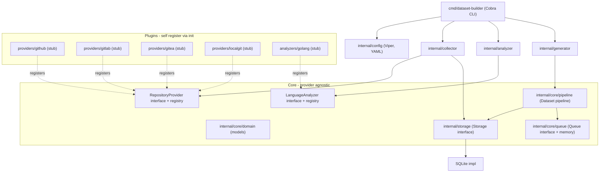
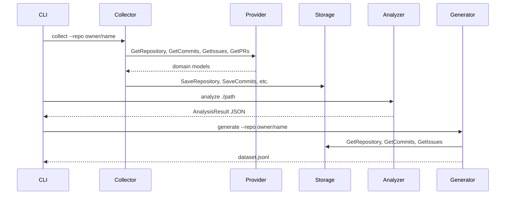

# Architecture

## Overview

RepoMiner (dataset-builder) is a plugin-based Software Engineering Dataset Builder. The core is provider-agnostic: all source-control and language-specific logic lives in self-registering plugins under `plugins/`.

## Architecture Diagram



## Design Decisions

### 1. Compile-time plugin registry

Providers and analyzers register themselves via `init()` functions. The CLI entrypoint blank-imports plugin packages to trigger registration. This approach:

- Keeps the core free of provider-specific imports
- Avoids Go `.so` dynamic plugin complexity
- Is fully testable and portable across platforms

### 2. Separate provider and analyzer registries

Repository providers (`RepositoryProvider`) and language analyzers (`LanguageAnalyzer`) are independent plugin systems. A user can select `source.type: gitlab` and `analyzer.language: golang` in config without any code changes.

### 3. Interface-driven core

All external dependencies are behind interfaces:

| Interface | Purpose | Phase 0 impl |
|-----------|---------|--------------|
| `RepositoryProvider` | Source control platform access | Stub plugins |
| `LanguageAnalyzer` | Source code analysis | Stub golang plugin |
| `Storage` | Data persistence | SQLite |
| `Queue` | Job scheduling | In-memory FIFO |

### 4. SQLite for local development

Phase 0 uses `modernc.org/sqlite` (pure Go, no cgo) for zero-config local storage. The `Storage` interface allows swapping to PostgreSQL in Phase 5 without changing collector or generator code.

### 5. YAML-driven configuration

Viper loads `config.yaml` to select provider, analyzer, storage driver, and workspace paths. This satisfies the requirement that changing `analyzer.language: golang` selects the analyzer without code modification.

### 6. Domain models in core

Shared types (`Repository`, `Commit`, `PullRequest`, `Issue`, etc.) live in `internal/core/domain`. Providers map their platform-specific responses to these models; the core never sees provider-specific structs.

## Data Flow (future phases)



## Project Structure

```
dataset-builder/
├── cmd/dataset-builder/     CLI entrypoint
├── config/                  Example YAML config
├── internal/
│   ├── analyzer/            LanguageAnalyzer registry
│   ├── cli/                 Cobra commands
│   ├── collector/           Collection orchestrator
│   ├── config/              Viper config loader
│   ├── core/
│   │   ├── domain/          Shared domain models
│   │   ├── pipeline/        Dataset pipeline skeleton
│   │   ├── provider/        RepositoryProvider registry
│   │   └── queue/           Job queue interface + memory impl
│   ├── generator/           Dataset generation orchestrator
│   └── storage/
│       ├── storage.go       Storage interface
│       └── sqlite/          SQLite implementation
├── plugins/
│   ├── analyzers/golang/    Go language analyzer (stub)
│   └── providers/
│       ├── github/          GitHub provider (stub)
│       ├── gitlab/          GitLab provider (stub)
│       ├── gitea/           Gitea provider (stub)
│       └── localgit/        Local Git provider (stub)
└── docs/                    Architecture documentation
```

## Phase Roadmap

| Phase | Focus | Status |
|-------|-------|--------|
| 0 | Foundation (this) | Complete |
| 1 | Multi-source repository collector | Planned |
| 2 | Code intelligence (Go AST analyzer) | Planned |
| 3 | Dataset generator (JSONL / HuggingFace) | Planned |
| 4 | Repository intelligence and ranking | Planned |
| 5 | Production platform (API, workers, K8s) | Planned |
| 6 | AI dataset refinement (local LLM) | Planned |
